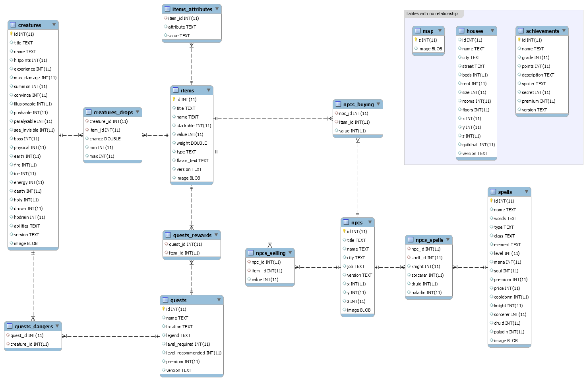

## Database model

## Additional information
* You can check the description of tables and collumns in the **SCHEMA.md** file;
* You can find examples of how to query the database in the **QUERIES.md** file;